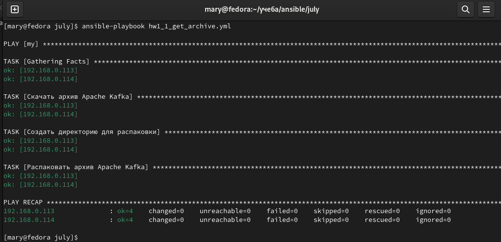
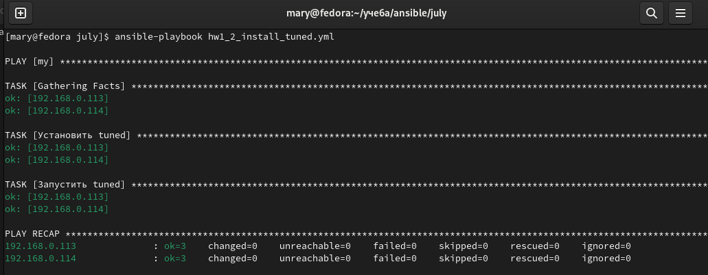
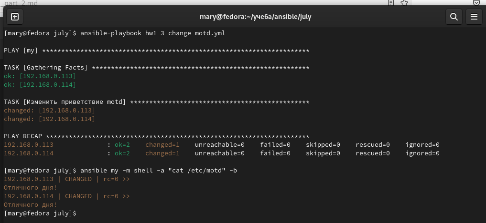
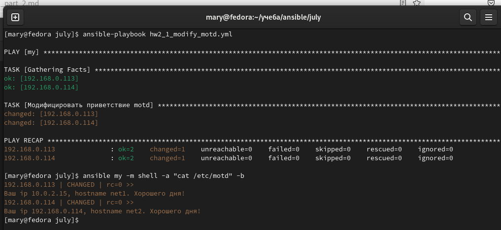
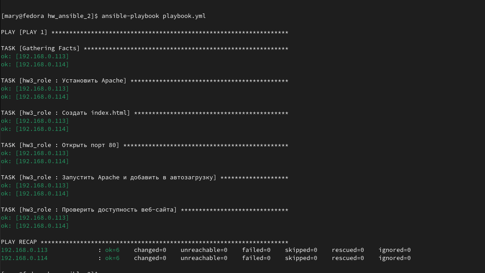
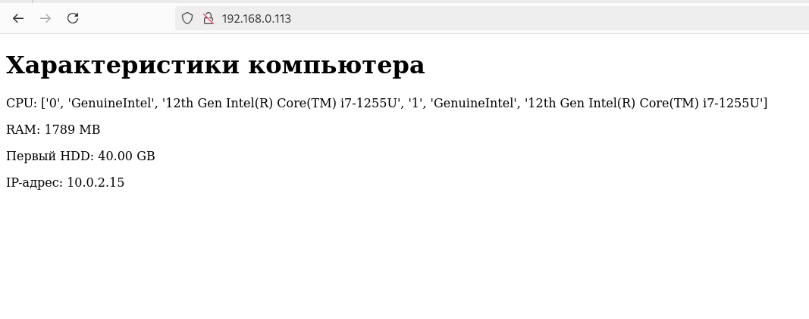
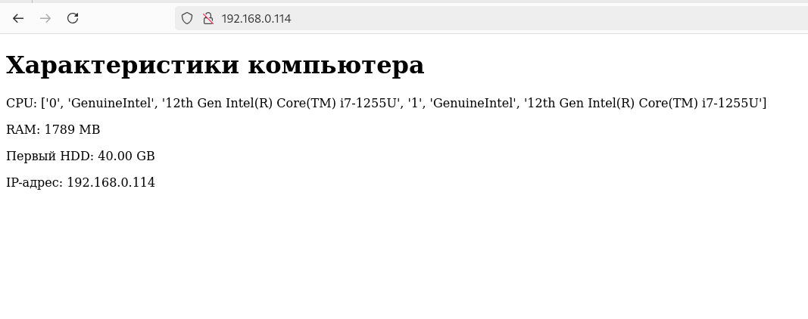

# Домашнее задание к занятию "Ansible. Часть 2" - Варфоломеева Марьяна

### Задание 1

Написать 3 плейбука:

1. **Скачать  и распаковать архив:**

[ Ссылка на плейбук ](./Playbooks/hw1_1_get_archive.yml)

Результат выполнения:

2. **Установить пакет tuned. Запустить и добавить в автозагрузку:**

[ Ссылка на плейбук ](./Playbooks/hw1_2_install_tuned.yml)

Результат выполнения:

3. **Изменить приветствие системы (motd):**

[ Ссылка на плейбук ](./Playbooks/hw1_3_change_motd.yml) 

Результат выполнения:

---

### Задание 2

Модифицируйте плейбук из пункта 3, задания 1. В качестве приветствия он должен установить IP-адрес и hostname управляемого хоста, пожелание хорошего дня системному администратору.

[ Ссылка на плейбук ](./Playbooks/hw2_1_modify_motd.yml) 

Результат выполнения:

---

### Задание 3

Написать плейбук с ролью для установки Apache (на CentOS 7). Вывести на стартовую страницу характеристики ВМ (CPU, RAM, величину первого HDD, IP-адрес):

[ Ссылка на архив с ролью ](./hw3_role.zip) 

Результат выполнения плейбука:

Вывод index.html у обеих ВМ:

